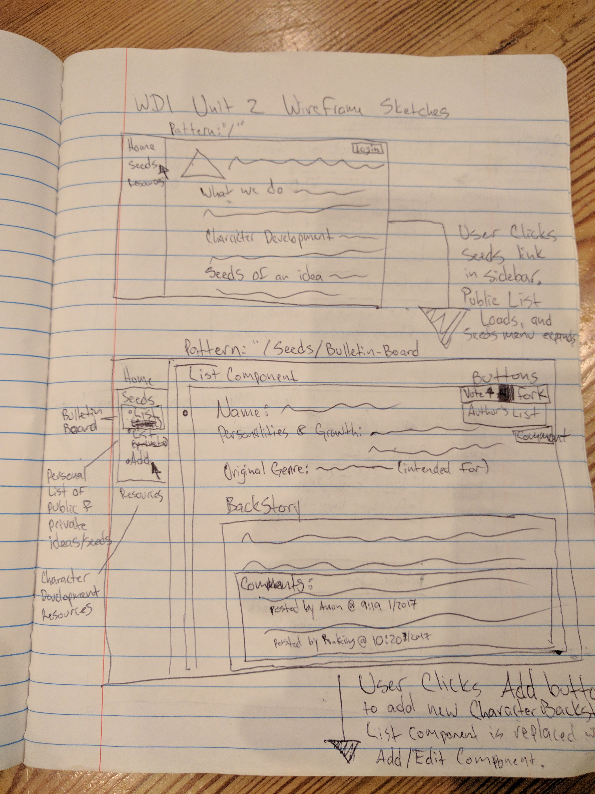
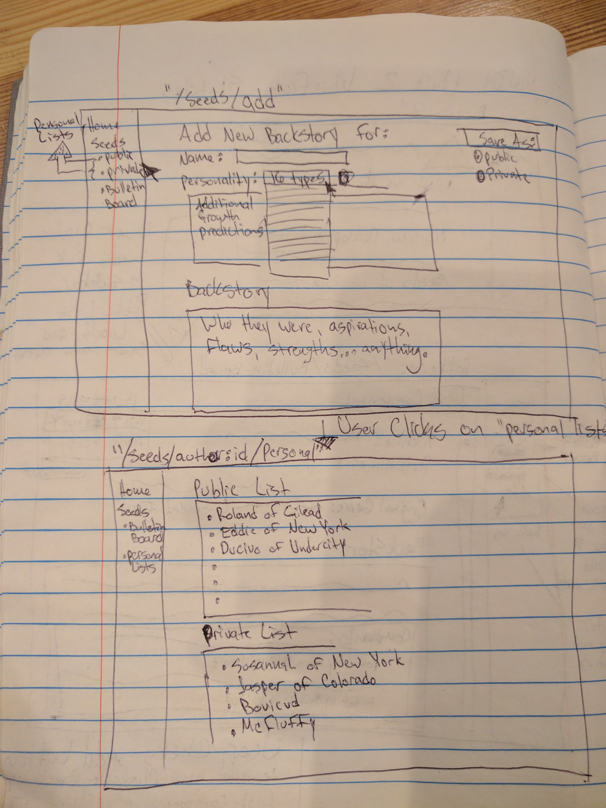

# Backstory Seeds
A simple React.js CRUD app that allows users to collaborate and share seeds of ideas for developed character backstories.

### Technologies Used
- React.js/JSX
- CSS/Flexbox

### Code Example
```javascript
render() {
    return (
      <BrowserRouter>
        <div className="App">
          <Header />
          <Match exactly pattern="/" component={Home} />
          <Match exactly pattern="/resources" component={Resources}  />
          <Match pattern="/seeds/bulletin-board"
            component={() =>
              <BulletinBoard
                seedsObj={this.state.seeds}
                onDeleteSeed={this.deleteSeed}
                onEditSeed={this.editSeed}
              />}
          />
          <Match pattern="/seeds/add-seed" component={() =>
            <AddSeed
              seedsObj={this.state.seeds}
              onAddSeed={this.addSeed}
            />
            }
          />
        </div>
      </BrowserRouter>
    );
  }
```
### Complications/Future Improvements
Complications/Challenges/Handicaps: 
- My first official React.js app in addition to my first CRUD app. The whole project was a delightful challenge. 
- Edit button to output edit form and sending a PATCH.

Future Improvements: 
- User logins with personalized lists
- Storyboarding and character development timeline

##### Initial wireframing in composition notebook!



